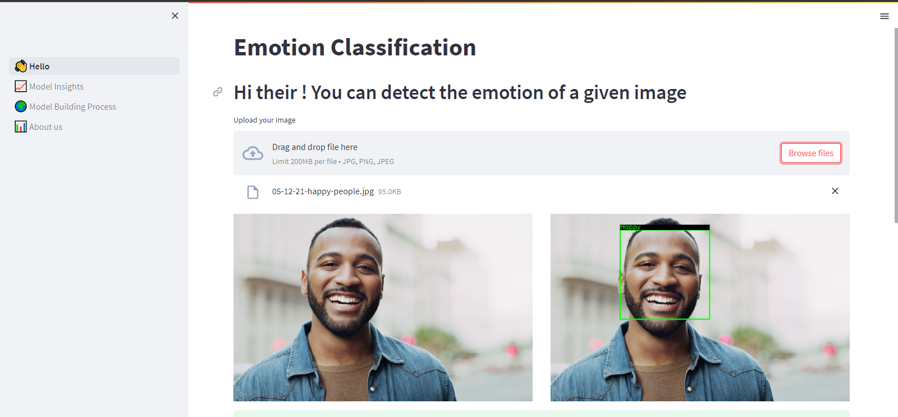

# Emotion-Classification-Detecion
Build Machine learning model that can detect the emotion in a given image
See the demo [here](https://otman-ai-gender-classification--hello-sko6hj.streamlit.app/)
## Content of this page:
* [What is Emotion classification](#what-is-emotion-classification)
* [How to use this repo](#how-to-use-this-repo)

##  What is Emotion classification:
Emotion classification Emotion recognition is the process of identifying human emotion. People vary widely in their accuracy at recognizing the emotions of others. Use of technology to help people with emotion recognition is a relatively nascent research area.


## How to use this repo:
To use this repo first, you need to clone it with this cammand below:
```
git clone https://github.com/otman-ai/Gender-Classification.git
```
After that you have to create your virtuel enviroment.Go to the your local directory then type:

```
python -m venv emotiondetection
```
install all the requirements:
```
pip install requirements.txt
```
in the repo you can find :
* `Emotion_detection` witch is notebook that content all of model building codes. 
* `👋_Hello.py` python script that deploys the model in to web server with  a help of streamlit.
* `model_matrix.csv` file iN csv format that track our models performance 
* inside *pages* folder there is :
* * `1_📈_Model_Insights.py`:model insight page 
* * `2_🌍_Model_Building_Processe.py`: model building processe page
* * `3_📊_About_us.py` : about the creator of the project page.

To see the demo run the following command:
```
streamlit run 👋_Hello.py
```

